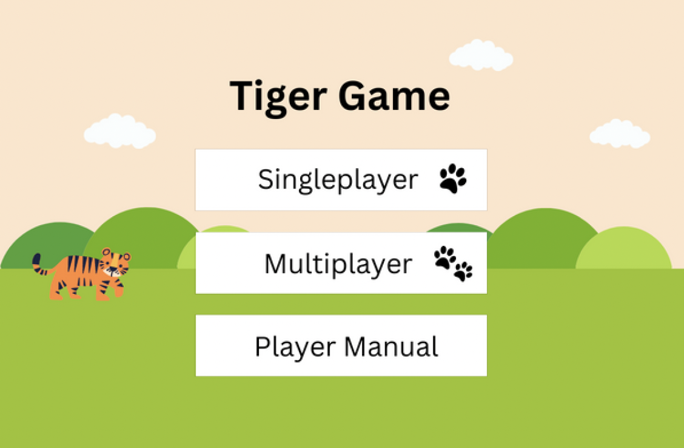
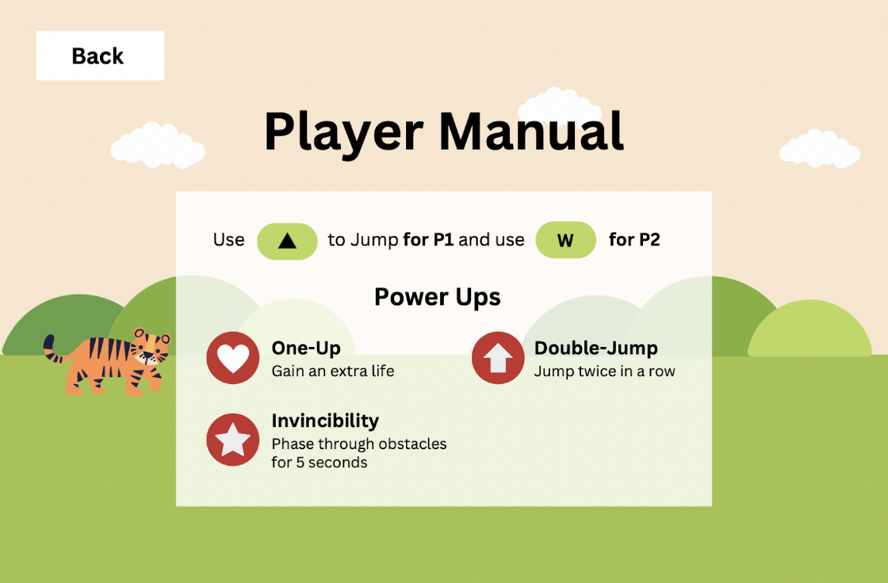
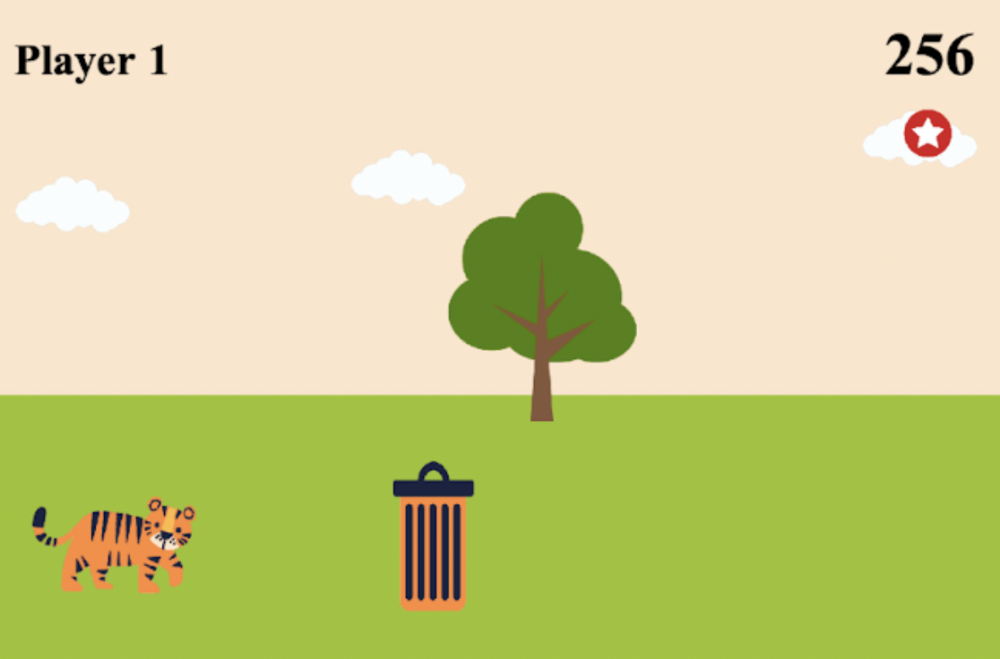
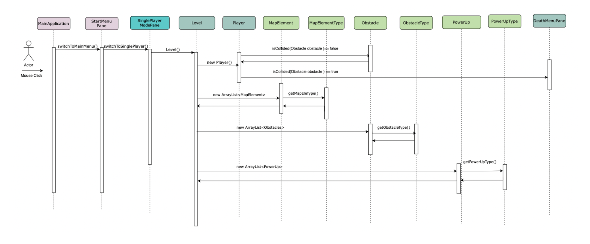
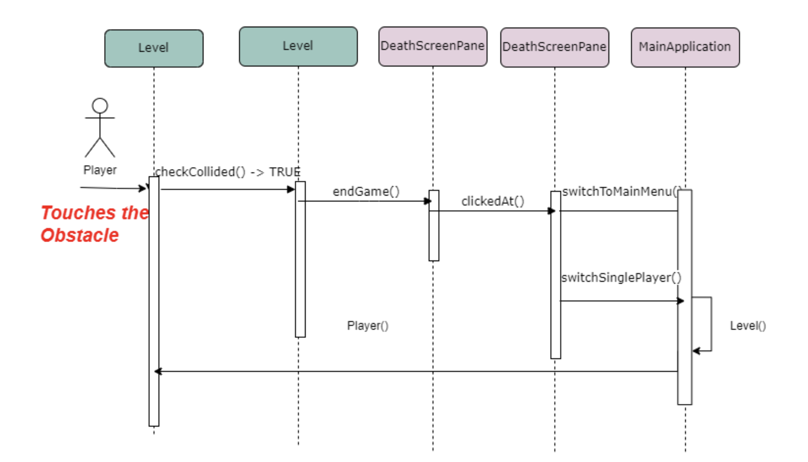
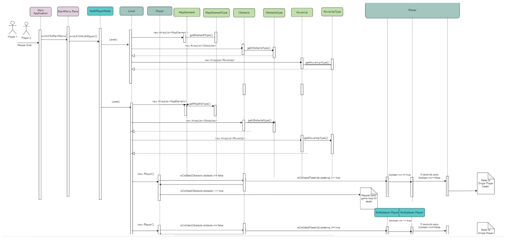
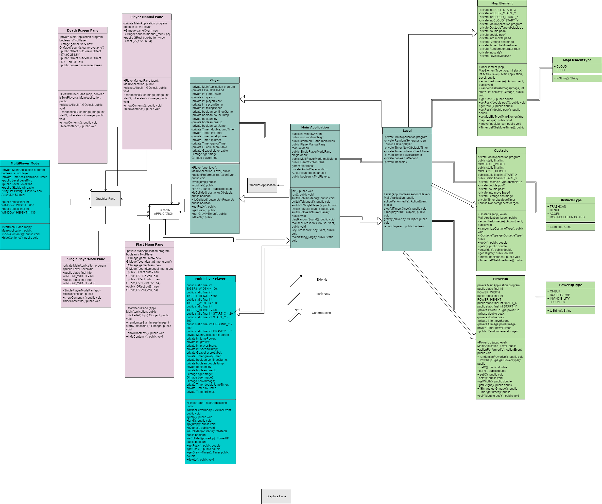

# Tiger Game

## About
This is Java-based game inspired by the classic Chrome Dinosaur Game with implemented multiplayer functionality and power-up features to enhance gameplay dynamics and player engagement. We also elevated the visual appeal and gameplay experience by designing custom characters, obstacles, backgrounds and theme music tailored to present the University of the Pacific.

## Authors
- Vy Nguyen
- Matthew Maragos
- Ramis Hasanli
- Clara Salazar  
- Ayden Cabral

## System Architecture and System Design
Hardware requirements:
- A colored monitor that is able to display a resolution of 600x436 (single player) or 600x872 (for multiplayer)
- A minimum of 1.68MB of space
- A keyboard (for up arrow and space bar) and mouse will be required 
- 10 MB of free RAM

## Functional Requirements Specification
In the **Single-Player** mode, the player attempts to get as far as possible without hitting any obstacles by jumping, while their score is being tracked in the top right corner. The player is able to obtain power ups, which includes **Double Jump** (jumping twice in a row), **Invincibility** (phasing through all obstacles) and **One Up** (gaining an extra life). The game will end when the player collides with an obstacle while not obtaining Invincibility or One Up.

Similarly, in the **Multiplayer** mode, the game starts with two vertically-stacked screens with two characters. They will compete to get as far as possible without hitting any obstacles by jumping and obtaining power ups. Their scores are tracked in the top right corner, and both of their games will end when either of the players collides with an obstacle while not obtaining Invincibility or One Up. The player with the longest distance is announced as the winner.

## Interaction Diagrams
**Single Player**

**Multiplayer**

## UML Diagram

## Conclusions and Future Work  
**Ramis**: First and foremost it was interesting for me to work with  group on Project.  When we encountered some troubles there was a possibility asking for advice and help from other team members. this ensured that the project will be done on time. On the mostly every step of development  we encountered various technical challenges that for example, we spent plenty of time figuring out how to switch between panes.  Also, it was difficult to implement back Collision detection and overall physics of the game. With help of team members and professor and teacher assistant , we were able to  implement our ideas in the project.  Some of the things that I learned in this project is to use the internet as a resource. There is plenty information and resources are available online, which can be helpful in Java development.  Previous knowledge in programming especially C plus plus  & OOP was very helpful in development strategies.  This project can be expanded in different ways.  For example, both single-player and multiplayer can be improved that also, there's a room for improvement in  data storage,  so we could have store the results of the games.  I mean advice for future business is to start work as early as possible to have less waiting time in the end of the semester. Also, it's always a good idea to approach your professor with the questions.

**Vy**: The biggest challenge I encountered during this project was creating and implementing the graphics. As each background element has a different image width and height, it is important to place it on the screen at the right coordinate to make the background move seamlessly. Breaking down big tasks into smaller and doable steps has helped me a lot. I first started with creating one bush, then adding another one with a different image, and finally was able to put them into an ArrayList and reused the code to implement the moving obstacles or power-ups. I strongly believe being able to create beautiful graphics can help make your game a lot more engaging and professional. Having the visual skills to choose an appealing color scheme or design nice characters can influence the look and feel of your game, not just the game's main idea. In the future, I hope to improve the user interface, such as making the power-up icon blink when it is about to expire, or having the background move right in the main menu instead of when single player mode starts. One advice I would give to future COMP 55 students is to create a clear project plan with their team and follow it. Even though progress is not always linear, having the plan lets you know what tasks you should be working on for that day or week.

**Clara**: Going from knowing C++ to Java was a challenge for me, it took me a bit to understand what the differences were and how it had its advantages and disadvantages. This meant that a lot of the syntax (lack of cout, cin etc) had me confused and it really took a lot of looking back at our Labs to understand what was needed. Outside of the class labs, luckily there are many online sources to understand what functions you can use with GImage and the Timer functions used in the game development. Going forward the game could use some simple animation here and there, possibly eliminating the need for the cloud movement, yet that would require more changes to the Pane classes and so forth. Finally as a piece of advice I would say that ambition is a wonderful thing but life and other classes can get in the way. Your brain may be filled with all these wonderful ideas but don’t be discouraged if not all can come to fruit.

**Matthew**: Movement in the game for me was the biggest technical challenge that came up because of how smooth it needed to be.  Out of all the movement however, jumping was the biggest challenge.  The approach to it was simple, but at the same time I didn’t know how jumping could be coded.  After using outside resources, I was able to make our jumping smoother, but changing that code made many problems.  Especially for the double jump power up we have.  I would say that the labs that are concerned with implementing images, moving those images, and using timers really supported this game.  Without any of those things there would be no game at all.  In the beginning we wanted to add leaderboards, so that’s a possible direction that this game can go.  As well as allowing the player that didn’t die in multiplayer to continue the game to get a highscore.  Then we can actually make it look like our tiger is moving by replacing it with one or multiple images while it’s running and jumping.  A piece of advice I say to future students is that you should get to know some or most of your classmates.  Doing that allows a better function within groups and knowing what each person can do can really make coding for the project easier.

**Ayden**: The main technical challenges encountered during the development of the Tiger Game was the addition of the movement, smooth jumping, and screen panes. Each of these involved deeper knowledge of the language as a whole and required technical know how. The labs which focused on the timers and hit boxes helped tremendously with this project, especially because they were needed for the game to even function. Some knowledge that might have helped with the project development was a deeper understanding of the ACM library. Additionally, better knowledge of timers would have also made this project easier. Regarding possible directions, gameplay wise there isn't much to add besides more power ups. However, the game could be taken into a more multiplayer direction, adding a scoreboard and having a battle royale mode where the longest distance wins. There are many more options when there is the ability to play with other players. One piece of advice I would give to future COMP 55 students is to rely on extra help. Whether it be the TA, a tutor or your fellow peers, relying on others would typically save a lot of time when encountering errors. Relying more on outside help would have most likely produced a better project.

## References with Annotations
Chrome Dinosaur Game. Google, 2014. https://chromedino.com
*The alternative link for the Dinosaur Game on Chrome, was a good reference throughout the project to understand how the game is supposed to function.*

Canva, 2022. https://www.canva.com
*The graphic design platform used to create the UI mock-up for our Tiger Game.*

GeeksforGeeks, 2022. https://www.geeksforgeeks.org/
*This website gives breakdowns for the syntax of the Java language we use for this game and libraries within it.*

CS Stanford, 2022. https://cs.stanford.edu/people/eroberts/jtf/javadoc/student/acm/graphics/GImage.html
*This website gives a breakdown of ACM Graphics, a library which is used consistently throughout the game.*

